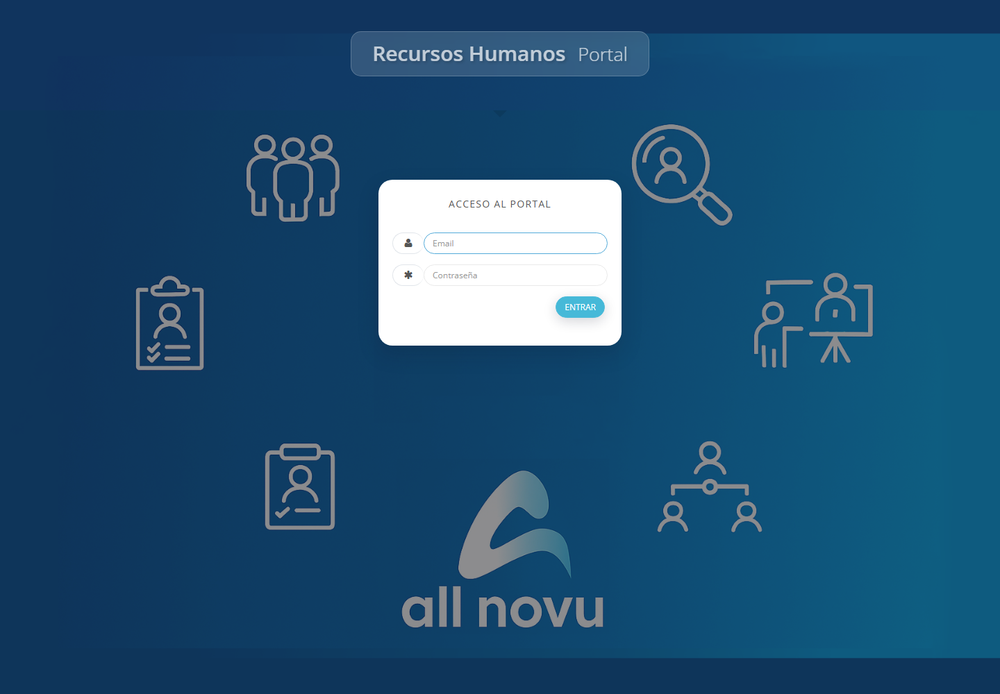

# Manual De Sistema de Recursos Humanos Allnovu

**Guía sencilla para las tareas diarias de Recursos Humanos**

**Edición: agosto de 2026**

Este manual está escrito con palabras sencillas. No necesita saber de informática. Trabaje con calma, revise los datos y guarde solamente cuando esté segura.

## 1. Antes de comenzar

- Pulse cada botón una sola vez y espere.
- Compruebe nombres, fechas, números y empresa antes de guardar.
- No comparta su contraseña.
- Si una opción no aparece, consulte con la persona administradora.
- El botón azul con el signo **?** abre este manual desde cualquier pantalla.

Botones frecuentes:

- **＋ Añadir:** crea una persona o un registro nuevo.
- **✎ Lápiz:** permite corregir información.
- **👁 Ojo:** abre la ficha para consultarla.
- **Buscar:** encuentra una persona o reduce una lista.
- **Descargar:** prepara un reporte para guardar o imprimir.

## 2. Entrar al sistema

1. Abra el Portal de Recursos Humanos.
2. Escriba su correo.
3. Escriba su contraseña.
4. Pulse **Entrar** una sola vez.
5. Espere hasta que aparezca la pantalla de inicio.

Para cambiar su contraseña, abra el menú personal y elija **Cambiar contraseña**. Escriba la contraseña actual y después la nueva dos veces.

## 3. Pantalla de inicio

La pantalla de inicio muestra un resumen del personal:

- trabajadores registrados y activos;
- personas presentes, ausentes o de vacaciones;
- cumpleaños próximos;
- vacaciones aprobadas;
- contratos próximos a terminar;
- recordatorios de Recursos Humanos.

Antes de comenzar, mire el nombre de la empresa en la parte superior. Toda la información que verá pertenece a esa empresa.

## 4. Tipos de acceso

| Tipo de acceso | Uso habitual |
|---|---|
| Administrador | Organiza personal, pagos, vacaciones, asistencia, recursos, evaluaciones y mensajes |
| Trabajador | Consulta su propia información y cambia su contraseña |
| Encargado de recursos | Controla artículos entregados y devueltos |
| Jefe de Área | Revisa al personal de sus áreas, asistencia, evaluaciones y vacaciones |

Para cambiar de empresa, pulse el símbolo de configuración, elija la empresa y espere a que la pantalla se actualice. Compruebe el nombre antes de guardar.

## 5. Cargos, departamentos y ubicaciones

- **Cargo:** puesto de trabajo, descripción, salario y funciones.
- **Departamento:** área a la que pertenece la persona.
- **Ubicación:** lugar físico donde trabaja.

Para añadir o corregir:

1. Entre en **General**.
2. Elija Cargos, Departamentos o Ubicaciones.
3. Pulse añadir o el lápiz.
4. Escriba la información.
5. Revise y guarde.

Antes de cambiar un salario, confírmelo con la persona responsable de Nómina.

## 6. Trabajadores

### Buscar una persona

1. Abra **Trabajadores**.
2. Escriba nombre, apellido o número de identidad.
3. Si la lista es larga, elija cargo, departamento o ubicación.
4. Pulse buscar.
5. Use el ojo para consultar o el lápiz para corregir.

### Registrar un trabajador

1. Pulse **Añadir trabajador**.
2. Complete nombres, apellidos, sexo y número de identidad.
3. Escriba dirección, provincia, municipio, correo y teléfono.
4. Elija nivel de estudios y licencias cuando corresponda.
5. Seleccione cargo, departamento, ubicación y fecha de contratación.
6. Añada una foto clara.
7. Complete tarjeta de salario y cuenta bancaria cuando estén disponibles.
8. Revise y guarde.

Antes de guardar confirme:

- nombres y apellidos;
- número de identidad;
- empresa, cargo, departamento y ubicación;
- fecha de contratación;
- teléfono y correo;
- foto correcta.

## 7. Ficha del trabajador

La ficha es el expediente digital de la persona. Reúne:

- datos personales y de contacto;
- cargo, departamento y ubicación;
- contratos y documentos;
- asistencia y vacaciones;
- pagos anteriores;
- evaluaciones;
- recursos entregados;
- mensajes enviados.

Para corregir información, busque a la persona, pulse el lápiz, cambie solamente lo necesario, revise y guarde.

### Salida de la empresa

1. Confirme con Nómina los pagos pendientes.
2. Revise vacaciones y otros importes.
3. Compruebe la devolución de recursos.
4. Realice la liquidación y después la baja.
5. Revise fecha de baja y situación final.

La baja forzada debe usarse solamente con autorización.

Para volver a contratar, abra la ficha anterior, elija reincorporación y complete empresa, cargo y nueva fecha.

## 8. Asistencia

1. Abra **Registro de Asistencias**.
2. Elija las fechas.
3. Si lo necesita, elija persona, ubicación o situación.
4. Pulse buscar.
5. Revise antes de corregir.

| Situación | Significado |
|---|---|
| Presente | Tiene registrada su entrada |
| Ausente | No aparece una entrada y no tiene vacaciones aprobadas |
| Vacaciones | Tiene un periodo aprobado |
| Horario especial | Trabaja con un horario diferente |
| Tardanza | Entró después del horario establecido |

Para justificar, localice la fecha, abra corregir o justificar, elija el motivo, escriba una explicación breve y guarde.

## 9. Vacaciones

**Solicitud pendiente → revisión del área → aprobación final → inclusión en el periodo correspondiente**

### Crear una solicitud

1. Abra Vacaciones o Planificación de Vacaciones.
2. Elija al trabajador.
3. Seleccione las fechas.
4. Revise días y saldo disponible.
5. Compruebe que no exista otra solicitud para esas fechas.
6. Guarde.

### Aprobar

1. Abra las solicitudes pendientes.
2. Revise persona, área, fechas y días.
3. El Jefe de Área realiza la primera revisión cuando corresponde.
4. La persona administradora aprueba o rechaza definitivamente.
5. Compruebe la nueva situación en la lista.

Si una solicitud aprobada se cancela antes de comenzar, elimínela correctamente para devolver los días al saldo.

## 10. Preparación del pago mensual

1. Abra **Prenómina**.
2. Elija mes, año y empresa.
3. Revise un departamento cada vez.
4. Compruebe horas y ausencias.
5. Añada bonificaciones autorizadas.
6. Revise días y pago de vacaciones.
7. Compruebe el total de cada persona.
8. Guarde primero y descargue el reporte después de revisar.

El sistema realiza los cálculos. Su tarea es confirmar que las horas, ausencias, bonificaciones y vacaciones sean correctas.

Antes de terminar compruebe:

- mes, año y empresa;
- todos los departamentos;
- ausencias y vacaciones;
- bonificaciones autorizadas;
- personas en proceso de baja;
- totales del mes.

En **Cuentas Bancarias** puede revisar tarjeta y cuenta. En **Ayudas a Trabajadores** puede registrar tipo de ayuda, importe, moneda, fecha y explicación.

## 11. Recursos entregados

### Entregar

1. Abra Recursos.
2. Busque el artículo y confirme que está disponible.
3. Pulse asignar.
4. Elija trabajador y fecha.
5. Complete marca, modelo, color u otros datos.
6. Guarde y compruebe que aparezca asignado.

### Devolver

1. Busque el recurso asignado.
2. Abra devolución.
3. Confirme persona, artículo y fecha.
4. Guarde.
5. Compruebe que vuelva a estar disponible.

Antes de una baja, confirme que todos los recursos hayan sido devueltos.

## 12. Evaluaciones

1. Abra **Evaluaciones → Listado**.
2. Busque a la persona o elija su cargo.
3. Lea cada aspecto.
4. Escriba una puntuación dentro del máximo indicado.
5. Revise el total.
6. Guarde y confirme.

| Resultado | Interpretación |
|---|---|
| Mal | Necesita atención y un plan de mejora |
| Regular | Cumple parcialmente |
| Bien | Buen desempeño general |
| Excelente | Desempeño destacado |

Use el mismo criterio para personas con trabajos semejantes.

## 13. Bolsa de empleo

Para registrar un candidato: abra Bolsa de Empleo, pulse añadir, escriba sus datos, añada el currículum y guarde.

Para contratar: busque al candidato, revise el currículum, pulse **Contratar**, complete los datos laborales y guarde la nueva ficha.

## 14. Mensajes

### Mensaje a un grupo

1. Abra **Notificaciones SMS**.
2. Elija departamentos y ubicaciones.
3. Revise cuántas personas lo recibirán.
4. Escriba un mensaje corto y claro.
5. Revise destinatarios y texto.
6. Confirme una sola vez.

Para una sola persona, abra su ficha y confirme el teléfono antes de enviar.

No envíe salarios, cuentas bancarias, evaluaciones ni información delicada por mensaje.

## 15. Contratos y documentos

1. Abra la ficha y entre en Contratos.
2. Revise tipo de contrato, cargo, salario y fechas.
3. Complete la información.
4. Use la vista previa para leer.
5. Corrija antes de guardar o imprimir.
6. Compruebe que aparezca en la ficha.

Cuando cambie cargo o salario, revise el documento que deja constancia del cambio. No elimine contratos anteriores.

## 16. Revisiones y reportes

### Al terminar el día

- asistencia y ausencias revisadas;
- justificaciones guardadas;
- solicitudes nuevas atendidas;
- datos urgentes corregidos;
- mensajes comprobados.

### Al terminar el mes

- todos los departamentos revisados;
- vacaciones y ausencias confirmadas;
- bonificaciones autorizadas;
- personas de baja revisadas;
- pago mensual guardado;
- reporte final descargado y protegido.

Los reportes contienen información personal. Guárdelos en el lugar autorizado.

## 17. Problemas frecuentes

- **No puedo entrar:** vuelva a escribir correo y contraseña con calma.
- **No encuentro a una persona:** limpie la búsqueda, confirme la empresa y pruebe con un apellido.
- **No veo una opción:** puede no corresponder a su acceso; consulte con la persona administradora.
- **Guardé algo incorrecto:** no cree otro registro; busque el existente y use el lápiz.
- **La pantalla tarda:** espere y no pulse Guardar repetidamente.
- **Necesito el manual:** pulse el botón azul con el signo **?**.

## Reglas de cuidado

- Cierre la sesión al alejarse.
- No comparta contraseñas.
- No deje reportes impresos a la vista.
- Confirme persona y empresa antes de guardar.
- Pida ayuda antes de usar una opción desconocida.

**Trabajar despacio y revisar antes de guardar evita la mayoría de los errores.**
